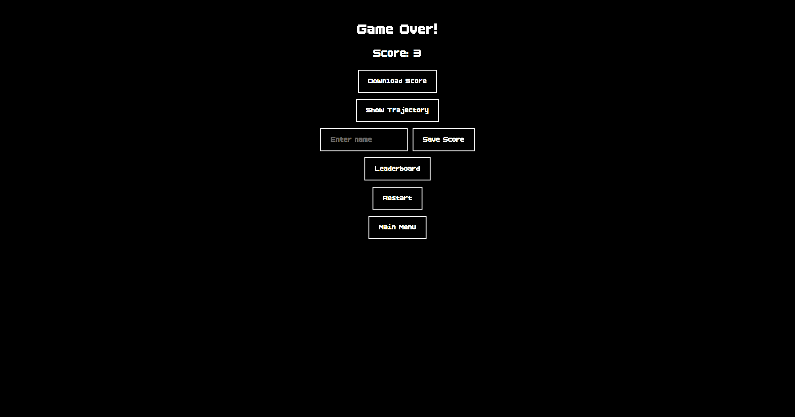
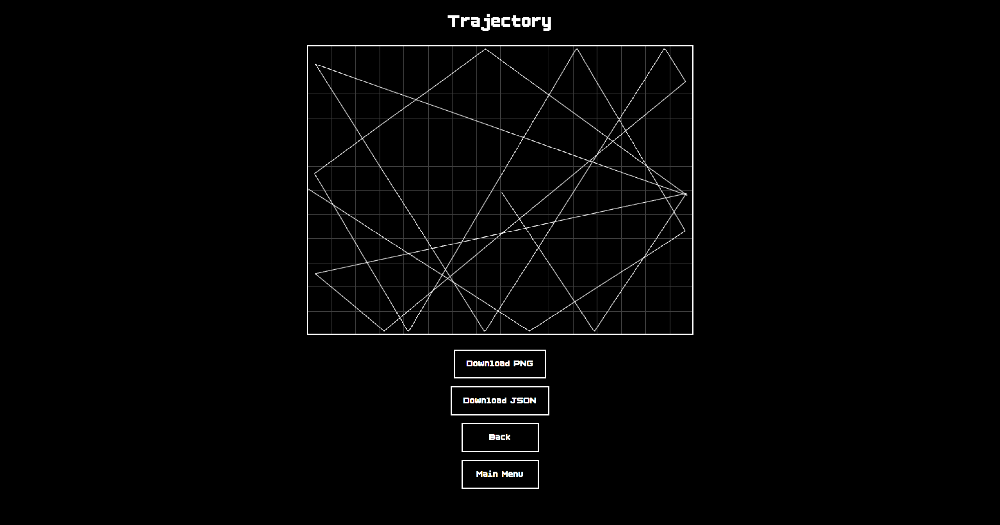

# Pong Survival

Pong Survival is a game where you have to stay alive as long as possible.

Try to beat your personal high scores. If you are content with a score, you can save it to the local leaderboard. After each game, you can take a look at the ball's full trajectory. You may even export your scores, trajectories, and leaderboard to save them on your device and cherish them forever.

Use the arrow keys or mouse/touch controls to move your paddle and see how long you can survive.

Have fun!

## Screenshots

  
  

  
  

  

